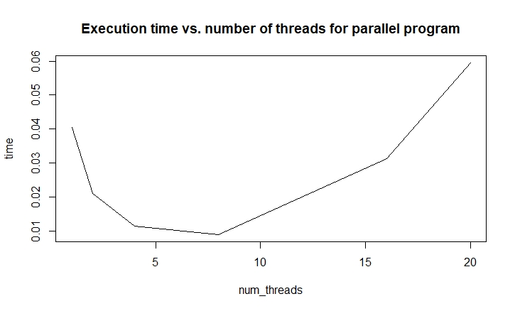

# Lab 1 - Exercise 1

Approximate pi.

File `ex01_serial.c` contains the serial implementation, while `ex01_parallel.c` the parallel one with the `#pragma omp atomic` method for the reduction of pi.

Compile with `icc filename.c -qopenmp` (Intel compiler).

Scalability plot with granularity 1e7:

# TODOs

add script

scalability for reduce + critical
